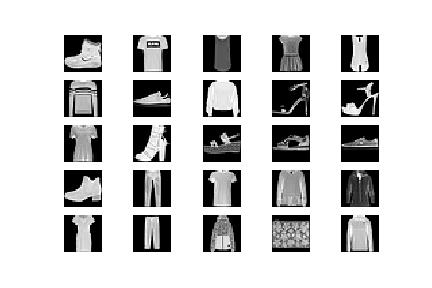
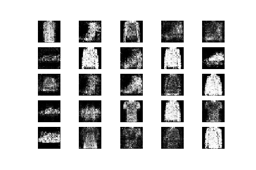

## Generative Adversarial Networks (GAN) for Fashion MNIST images

### Project for generate new images for Fashion MNIST

This proejct uses 
- Keras
- Python
- Jupyter
- Numpy
- Matplotlib

    

  <b>Original</b> 

     

  <b>Generate</b> 

### Reference
- https://github.com/tjwei/GANotebooks
- https://github.com/tensorflow/hub
- https://github.com/eriklindernoren/Keras-GAN/
- https://www.cs.toronto.edu/~slwang/generative_model.pdf
- https://www.oreilly.com/library/view/generative-deep-learning/9781492041931/ch01.html
- https://skymind.ai/wiki/generative-adversarial-network-gan
- https://junyanz.github.io/CycleGAN/
